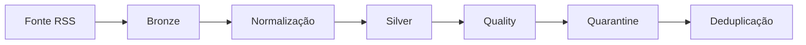

<div align="center">

# 📰 InfoHub

-0077B6?style=for-the-badge)


Plataforma pública para **coletar, normalizar, validar, organizar e publicar** conteúdo estruturado.

</div>

> 📌 **Status:** desenvolvimento encerrado. Projeto congelado como portfólio — não é uma plataforma comercial em operação. Detalhes em [`docs/PROJECT-STATUS.md`](docs/PROJECT-STATUS.md).

## 🚫 Fora do escopo final

| Não incluído nesta versão |
|---|
| Agente operacional autônomo |
| Publicação automática completa |
| Monetização, afiliados e revenue tracking |
| Notificações financeiras |
| Analytics próprio |
| Desenvolvimento autônomo contínuo |

## 🔄 Pipeline de ingestão



- Bronze, Silver, quarantine e relatórios de *quality* são artefatos locais.
- A API de ingestão cria rascunhos; a API de publicação usa uma chave separada.
- O pipeline **não publica automaticamente**.

## ✅ Funcionalidades

| 🌐 Web & API | 🗄️ Dados & Pipeline |
|---|---|
| Páginas públicas de conteúdo | Banco de dados relacional (categorias, fontes, tags, aliases) |
| Páginas por categoria | Pipeline RSS (Bronze → Silver) |
| Busca | Quality gate |
| SEO básico, sitemap e robots | Quarantine |
| API versionada (consulta pública) | Deduplicação persistente |
| API protegida de ingestão | Dry-run |
| API protegida de publicação | Testes automatizados + CI |

## 🔐 Segurança

SQL parametrizado · autenticação por chave · proteção contra SSRF e DNS rebinding · redirects revalidados · limite de 2 MiB por resposta RSS · quarantine · dry-run.

📄 Detalhes completos em [`docs/SECURITY.md`](docs/SECURITY.md).

## 🗂️ Estrutura

```text
app/                    Páginas públicas e rotas de API do Next.js
lib/                    Acesso a dados e lógica compartilhada
database/               Schema SQL inicial
docs/                   Documentação do projeto
scripts/ingestion/      Cliente demonstrativo de ingestão
scripts/pipeline/       Pipeline RSS e testes isolados
scripts/tests/          Testes manuais de integração
.agents/skills/         Instruções locais para desenvolvimento
```

## 🚀 Rodando localmente

<details>
<summary>Clique para expandir</summary>

```bash
npm ci                       # instalar dependências
cp .env.example .env.local   # configurar variáveis locais
npm run dev                  # iniciar em http://localhost:3000
```

Banco local compatível com `database/001_initial_schema.sql`. Nunca versione `.env.local`.

</details>

## 🧪 Validação

| Comando | O que faz |
|---|---|
| `npm run lint` | Lint |
| `npm run typecheck` | Checagem de tipos |
| `npm test` | Testes |
| `npm run check` | lint → typecheck → testes do pipeline |
| `npm run build` | Build de produção |

O CI (GitHub Actions) roda `npm ci`, `npm run check` e `npm run build`. Testes automatizados não usam Railway, banco de produção ou credenciais reais.

## ⚙️ Pipeline manual

```bash
npm run pipeline:test
```

| Modo | Comportamento |
|---|---|
| `PIPELINE_DRY_RUN=true` (padrão) | Coleta e valida sem gravar nada |
| `PIPELINE_DRY_RUN=false` | Grava artefatos e fingerprints localmente |

A publicação continua fora do pipeline em qualquer modo.

## 🔑 Variáveis de ambiente

| Grupo | Uso |
|---|---|
| `DATABASE_*` | Conexão com o banco |
| `INGESTION_API_KEY` | Autenticação da API de ingestão |
| `PUBLISH_API_KEY` | Autenticação da API de publicação |
| `INGESTION_*` | Configuração do coletor |
| `INFOHUB_API_URL` / `INFOHUB_BASE_URL` | URLs da aplicação |
| `PIPELINE_*` | Configuração do pipeline |

Nomes completos em `.env.example`; valores reais nunca vão para o Git.

## 🏭 Produção

> ⚠️ Scripts de teste, migrações, ingestão real e publicação **não devem rodar contra produção sem autorização humana explícita**.

Hospedagem original: Railway (app + banco). O encerramento da infraestrutura ocorre só após backups e verificações.

## 📚 Documentação

| Documento | Conteúdo |
|---|---|
| [PROJECT-STATUS.md](docs/PROJECT-STATUS.md) | Status final |
| [DEVELOPMENT-JOURNAL.md](docs/DEVELOPMENT-JOURNAL.md) | Diário de desenvolvimento |
| [DECISIONS.md](docs/DECISIONS.md) | Decisões técnicas |
| [ARCHITECTURE.md](docs/ARCHITECTURE.md) | Arquitetura |
| [SECURITY.md](docs/SECURITY.md) | Segurança |
| [ROADMAP.md](docs/ROADMAP.md) | Roadmap e escopo encerrado |

## 🤖 Desenvolvimento assistido por IA

IA foi usada para implementação, análise, testes, documentação, revisão e investigação — sempre com **validação humana**, revisão de diff, testes e checkpoints Git antes de mudanças sensíveis.

---

<div align="center">

**InfoHub** — estudo de caso de engenharia de software assistida por IA, congelado como projeto de portfólio.

</div>
