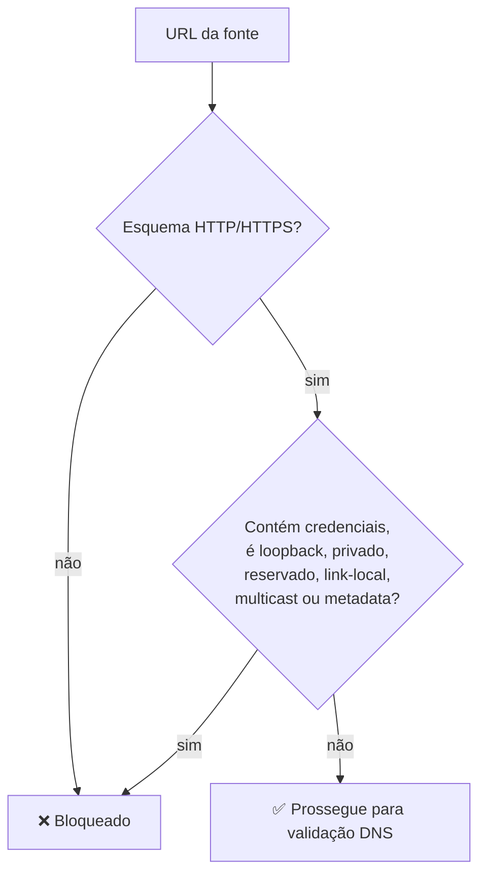
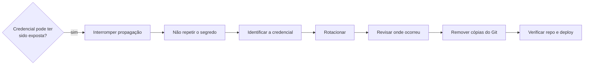

# 🛡️ InfoHub — Segurança

-0077B6?style=for-the-badge)

> ⚠️ A segurança do projeto **não é apresentada como absoluta**. Este documento registra as ameaças analisadas e os controles implementados — não substitui uma auditoria independente.

## 🎯 O que é protegido

`Credenciais` · `Chaves de API` · `Banco de dados` · `Aplicação pública` · `Endpoints de ingestão` · `Fluxo de publicação` · `Integrações externas` · `Dados do pipeline`

*Funcionalidades financeiras e de monetização não fazem parte da versão final.*

## 🔑 Segredos & credenciais

| Prática |
|---|
| `.env.local` e `.env.local.*` fora do Git |
| `.env.example` mantém só os nomes das variáveis |
| Segredos nunca aparecem em logs |

## 🗄️ Banco de dados & 🔐 Autenticação

- Consultas **parametrizadas** — entradas externas nunca são concatenadas em SQL.
- Operações protegidas exigem autenticação por chave.
- Ingestão e publicação usam chaves **separadas** (`INGESTION_API_KEY` / `PUBLISH_API_KEY`), reduzindo o escopo de uma credencial comprometida.

## 🌐 Conteúdo externo & SSRF

Toda fonte RSS é tratada como **não confiável** — mesmo que pré-configurada.

## 🧬 DNS & anti-rebinding

1. Resolve o hostname.
2. Valida **todos** os endereços retornados.
3. Seleciona um endereço permitido.
4. Conecta usando esse endereço validado (sem repetir a resolução).
5. Preserva o hostname original para o header HTTP.

## 🔀 Redirects

Cada redirect é **revalidado do zero** — uma URL permitida não pode redirecionar para um destino bloqueado sem nova checagem.

## 📦 Limites & isolamento

| Controle | Valor |
|---|---|
| Tamanho máximo de resposta RSS | **2 MiB** (aplicado no streaming) |
| Itens rejeitados | Vão para **quarantine**, não são descartados nem tratados como válidos |
| Modo padrão do pipeline | **Dry-run** (sem efeitos persistentes) |

## 🪵 Logs

Nunca expõem: senhas, chaves de API, strings de conexão, credenciais ou dados sensíveis desnecessários. URLs de fontes externas são registradas evitando exposição desnecessária.

## 🏭 Produção

> 🚫 Testes, scripts experimentais, migrações, ingestão real, publicação e alterações destrutivas **não rodam contra produção sem autorização humana explícita**.

## 🤖 IA no desenvolvimento

IA auxilia implementação e revisão, mas **não é autoridade final** para operações sensíveis. O processo incluiu revisão de diff, testes, checkpoints Git e revisão específica de segurança.

Agentes/automações **nunca devem**:

`imprimir segredos` · `commitar segredos` · `desabilitar controles para passar testes` · `apagar dados de produção` · `alterar autenticação/autorização silenciosamente` · `afirmar segurança absoluta`

## 🚨 Se uma credencial vazar

## 📌 Estado de encerramento

Projeto congelado como estudo de caso técnico. Os controles aqui descritos refletem a versão final — **não são garantia de segurança absoluta** nem substituem auditoria independente.
